### 

### **Comprehensive Linux Operations**

#### **Project Overview**

This project spans various aspects of Linux system administration,
including file management, user and group management, service control,
process handling, and more. You will be completing tasks that simulate
real-world scenarios, providing hands-on experience with Linux commands
and configurations.

### **Project Breakdown**

#### **Part 1: Creating and Editing Text Files (20 minutes)**

**Scenario:** You are tasked with documenting the configurations and
settings for a new server. You\'ll use different text editors to create
and update these documents.

1.  **Using Nano**

Create a file server_config.txt using Nano :\
\
nano server_config.txt

-   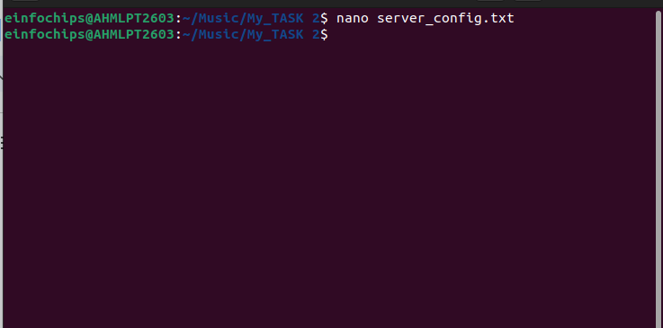

Add the following content:\
\
Server Name: WebServer01

IP Address: 192.168.1.100

OS: Ubuntu 20.04

-   

-   Save and exit (Ctrl+O, Enter, Ctrl+X).

2.  **Using Vi**

Edit the same file with Vi:\
\
vi server_config.txt

-   

Append the following text:\
\
Installed Packages: Apache, MySQL, PHP

-   

-   Save and exit (Esc, :wq).

3.  **Using Vim**

Further edit the file with Vim:\
\
vim server_config.txt

-   

Add the following text:\
\
Configuration Complete: Yes

-   Save and exit (Esc, :wq).

#### **Part 2: User & Group Management (20 minutes)**

**Scenario:** You need to set up user accounts and groups for a new team
joining the project.

1.  **Adding/Removing Users**

**Add a new user developer:**\
\
sudo adduser developer

Or sudo useradd developer

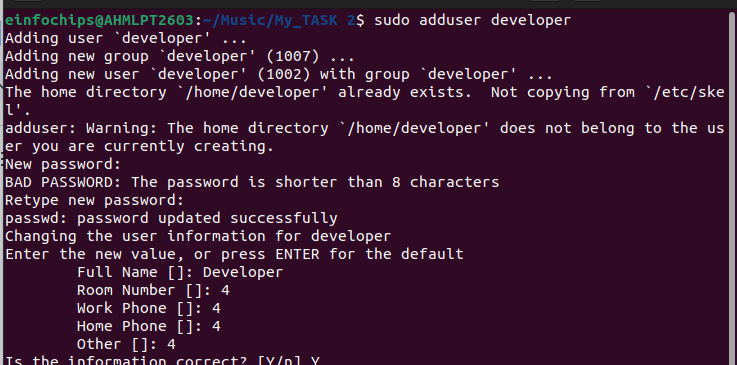
**Remove the user developer:**\
\
sudo deluser developer

Or

sudo userdel developer

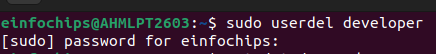

2.  **Managing Groups**

**Create a group devteam:**\
\
sudo groupadd devteam

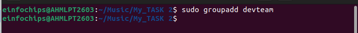
**Add the user developer to the devteam group:**\
\
sudo usermod -aG devteam developer

-a (append): This option tells usermod to add the user to the
supplementary group(s) without removing them from any other groups they
are already a member of.

-G (groups): This option is used to specify the list of supplementary
groups the user should be added to.

The usermod command in Linux is used to modify an existing user\'s
account details. It allows administrators to change various attributes
of a user, such as their username, home directory, shell, and group
memberships.

Examples

Sudo usermod -l dev developer

Sudo usermod +L dev

Sudo usermod +U dev

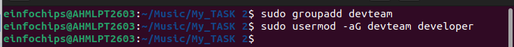

**Remove the user developer from the devteam group:**\
\
sudo gpasswd -d developer devteam

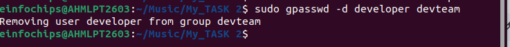{width="6.5in"
height="0.5972222222222222in"}

#### **Part 3: File Permissions Management (20 minutes)**

**Scenario:** Ensure that only the appropriate users have access to
specific files and directories.

1.  **Understanding File Permissions**

View permissions for server_config.txt:\
\
ls -l server_config.txt

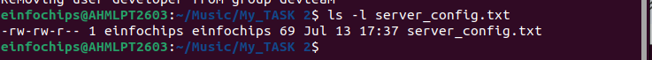

-   Discuss the output (e.g., -rw-r\--r\--).

-   

2.  **Changing Permissions and Ownership**

Change permissions to read/write for the owner and read-only for
others:\
\
chmod 644 server_config.txt

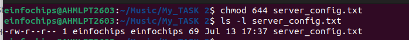

### **Understanding File Permissions**

File permissions are represented as a set of three groups, each
containing three bits:

1.  **User (owner)**

2.  **Group**

3.  **Others**

Each group of three bits represents:

-   **Read (r)**: Permission to read the file (4)

-   **Write (w)**: Permission to write to the file (2)

-   **Execute (x)**: Permission to execute the file (1)

For example, a permission set of rwxr-xr\-- means:

-   **User**: read, write, and execute (rwx = 4+2+1 = 7)

-   **Group**: read and execute (r-x = 4+1 = 5)

-   **Others**: read only (r\-- = 4+0+0 = 4)

### **Using chmod with Numeric (Octal) Mode**

In numeric mode, permissions are represented by a three-digit octal
number, where each digit ranges from 0 to 7:

-   **7**: read, write, and execute (rwx)

-   **6**: read and write (rw-)

-   **5**: read and execute (r-x)

-   **4**: read only (r\--)

-   **3**: write and execute (wx)

-   **2**: write only (w-)

-   **1**: execute only (x)

-   **0**: no permissions (\-\--)

Examples:

-   chmod 755 file sets permissions to rwxr-xr-x.

-   chmod 644 file sets permissions to rw-r\--r\--.

Verify the change:\
\
ls -l server_config.txt

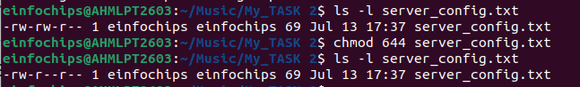{width="6.5in"
height="0.9861111111111112in"}

Change the owner to developer and the group to devteam:

The chown command in Linux is used to change the ownership of files and
directories. Ownership includes both the user (owner) and the group
associated with the file or directory.\
\
sudo chown developer:devteam server_config.txt

Verify the change:\
\
ls -l server_config.txt

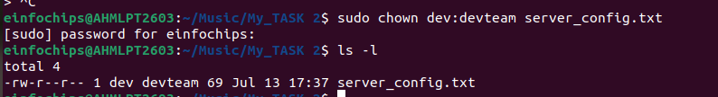{width="6.5in"
height="0.8888888888888888in"}

#### **Part 4: Controlling Services and Daemons (20 minutes)**

**Scenario:** Manage the web server service to ensure it is running
correctly and starts on boot.

1.  **Managing Services with systemctl**

Start the Apache service:\
\
sudo systemctl start apache2

Stop the Apache service:\
\
sudo systemctl stop apache2

Enable the Apache service to start on boot:\
\
sudo systemctl enable apache2

Disable the Apache service:\
\
sudo systemctl disable apache2

Check the status of the Apache service:\
\
sudo systemctl status apache2

2.  **Understanding Daemons**

    -   Discuss the role of the sshd daemon in providing SSH access to
        > the server.

#### **Part 5: Process Handling (20 minutes)**

**Scenario:** Monitor and manage processes to ensure the server is
performing optimally.

1.  **Viewing Processes**

List all running processes:\
\
ps aux

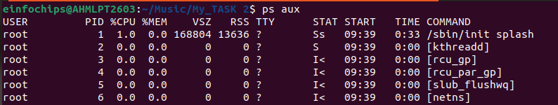
Use top to view processes in real-time:\
\
top

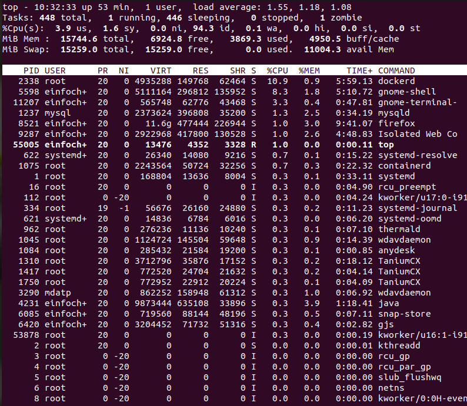

2.  **Managing Processes**

Identify a process to kill using ps or top, then kill it:\
\
kill \<PID\>

Zombie Process

ps aux \| grep \"Z\"

Change the priority of a process (e.g., running sleep with a lower
priority):

In Linux, the priority of a process determines its importance and how
much CPU time it receives relative to other processes. Process priority
is managed by the kernel scheduler and is represented by a numerical
value called the \"priority value\" or \"nice value\".

**Nice Value (nice)**:

-   The nice value ranges from -20 to +19.

-   Lower nice values indicate higher priority (more favorable
    > scheduling).

-   Higher nice values indicate lower priority (less favorable
    > scheduling).

-   A process with a lower nice value gets more CPU time compared to
    > processes with higher nice values.

**Static Priority (priority)**:

-   The static priority ranges from 0 to 139 (in some older systems, it
    > was 0 to 99).

-   The static priority is calculated from the nice value and adjusted
    > based on the scheduling policy and the current load on the system.

-   Lower static priority values correspond to higher priorities.

nice -n 10 sleep 100 &

-   

Change the priority of the process using renice:\
\
renice +10 \<PID\>

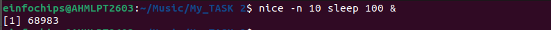

### **Filesystem Hierarchy Standard (FHS):**

-   ### **Linux follows the FHS, which defines the purpose and organization of directories in the filesystem.**

-   ### **Key directories include:**

    -   ### **/bin: Essential binaries (commands) for system boot and repair.**

    -   ### **/sbin: System binaries (commands) for system administration (superuser mode).**

    -   ### **/usr: User-related data including binaries, libraries, documentation, and more.**

    -   ### **/etc: Configuration files for system-wide and application-specific settings.**

    -   ### **/home: User home directories, where users store personal files and configurations.**

    -   ### **/opt: Optional application software packages.**

### **System Binaries (/bin, /sbin, /usr/bin, /usr/sbin):**

-   ### **These directories contain executable binaries similar to what you might find in \"Program Files\" in Windows.**

-   ### **Most installed applications' binaries are located in /usr/bin or /usr/sbin.**

### 

**Mounting**

### **In Ubuntu Linux, \"mounting\" refers to the process of making a filesystem available for access and use by associating it with a directory (referred to as the \"mount point\") in the host filesystem\'s directory tree. This allows the files and directories stored on the mounted filesystem to be accessed and manipulated as if they were part of the host system\'s own filesystem.**

### **Understanding Mounting**

When you mount a filesystem:

-   **Mount Point**: A directory on the host system where the contents
    > of the mounted filesystem will be accessible.

-   **Filesystem**: The partition or device containing the files and
    > directories you want to access.

### 

### 

### 

### 

### 

### 

### 

### 

### 

### 

### **find: Search for files in a directory hierarchy.**

### **grep: Print lines that match patterns.**

grep "word" \| filename

### **locate: Find files by name.**

Locate filename

### **which: Locate a command.**

Which apache2

Which nginx

### **sort: Sort lines of text files.**

### **uniq: Report or omit repeated lines.**

### **wc: Print newline, word, and byte counts for each file.**

###  **Wc -w filename (count words)**

### 

### **System Monitoring and Performance**

-   ### **uptime: Tell how long the system has been running.**

-   ### **free: Display amount of free and used memory in the system.**

-   ### **vmstat: Report virtual memory statistics.**

-   ### **iostat: Report CPU and input/output statistics.**

-   ### **sar: Collect, report, or save system activity information.**

### **Disk Usage and Storage**

-   **df**: Display disk space usage.

-   **du**: Estimate file space usage.

### **System Information**

-   ### **uname: Print system information.**

-   ### **dmesg: Print or control the kernel ring buffer.**

-   ### **lsb_release: Print distribution-specific information.**

-   ### **hostname: Show or set the system\'s hostname.**

### 

### 

### 

### **Creating and Deploying a Static Website with Apache2**

#### **Preparation (5 minutes)**

-   Ensure you have access to a Linux environment (e.g., virtual
    > machines, EC2 instances, or local installations) with sudo
    > privileges.

### **Activity Breakdown**

#### **Part 1: Installing Apache2 (5 minutes)**

1.  **Update Package Lists**

Open the terminal and run:\
\
sudo apt update

-   

2.  **Install Apache2**

Install Apache2 by running:\
\
sudo apt install apache2

-   

3.  **Start and Enable Apache2**

Start the Apache2 service:\
\
sudo systemctl start apache2

-   

Enable Apache2 to start on boot:\
\
sudo systemctl enable apache2

-   

4.  **Verify Installation**

    -   Open a web browser and navigate to http://your_server_ip. You
        > should see the Apache2 default page.

#### **Part 2: Creating the Website (10 minutes)**

1.  **Navigate to the Web Directory**

Change to the web root directory:\
\
cd /var/www/html

-   

2.  **Create a New Directory for the Website**

Create a directory named mystaticwebsite:\
\
sudo mkdir mystaticwebsite

-   

Change ownership of the directory:\
\
sudo chown -R \$USER:\$USER /var/www/html/mystaticwebsite

3.  **Create HTML File**

Create and edit the index.html file:\
\
nano /var/www/html/mystaticwebsite/index.html

-   

Add the following content:\
\
\<!DOCTYPE html\>

\<html\>

\<head\>

\<title\>My Static Website\</title\>

\<link rel=\"stylesheet\" type=\"text/css\" href=\"styles.css\"\>

\</head\>

\<body\>

\<h1\>Welcome to My Static Website\</h1\>

\<p\>This is a simple static website using Apache2.\</p\>

\<script src=\"script.js\"\>\</script\>

\</body\>

\</html\>

-   

-   Save and exit (Ctrl+O, Enter, Ctrl+X).

4.  **Create CSS File**

Create and edit the styles.css file:\
\
nano /var/www/html/mystaticwebsite/styles.css

-   

Add the following content:\
\
body {

font-family: Arial, sans-serif;

background-color: #f0f0f0;

text-align: center;

margin: 0;

padding: 20px;

}

h1 {

color: #333;

}

-   

-   Save and exit (Ctrl+O, Enter, Ctrl+X).

5.  **Create JavaScript File**

Create and edit the script.js file:\
\
nano /var/www/html/mystaticwebsite/script.js

-   

Add the following content:\
\
document.addEventListener(\'DOMContentLoaded\', function() {

console.log(\'Hello, World!\');

});

-   

-   Save and exit (Ctrl+O, Enter, Ctrl+X).

6.  **Add an Image**

Download or copy an image file (e.g., logo.png) to the website
directory:\
\
cp /path/to/your/logo.png /var/www/html/mystaticwebsite/logo.png

-   

Update index.html to include the image:\
\
\<body\>

\<h1\>Welcome to My Static Website\</h1\>

\

\<p\>This is a simple static website using Apache2.\</p\>

\<script src=\"script.js\"\>\</script\>

\</body\>

-   

#### **Part 3: Configuring Apache2 to Serve the Website (10 minutes)**

1.  **Create a Virtual Host File**

Create and edit the virtual host configuration file:\
\
sudo nano /etc/apache2/sites-available/mystaticwebsite.conf

-   

Add the following content:\
\
\<VirtualHost \*:80\>

ServerAdmin webmaster@localhost

DocumentRoot /var/www/html/mystaticwebsite

ErrorLog \${APACHE_LOG_DIR}/error.log

CustomLog \${APACHE_LOG_DIR}/access.log combined

\</VirtualHost\>

-   Save and exit (Ctrl+O, Enter, Ctrl+X)

> .

2.  **Enable the New Virtual Host**

Enable the virtual host configuration:\
\
sudo a2ensite mystaticwebsite.conf

3.  **Disable the Default Site**

Disable the default site configuration:\
\
sudo a2dissite 000-default.conf

-   

4.  **Reload Apache2**

Reload the Apache2 service to apply the changes:\
\
sudo systemctl reload apache2

-   

5.  **Test the Configuration**

    -   Open a web browser and navigate to http://your_server_ip. You
        > should see the static website with the HTML, CSS, JS, and
        > image.

By JASH SHAH
