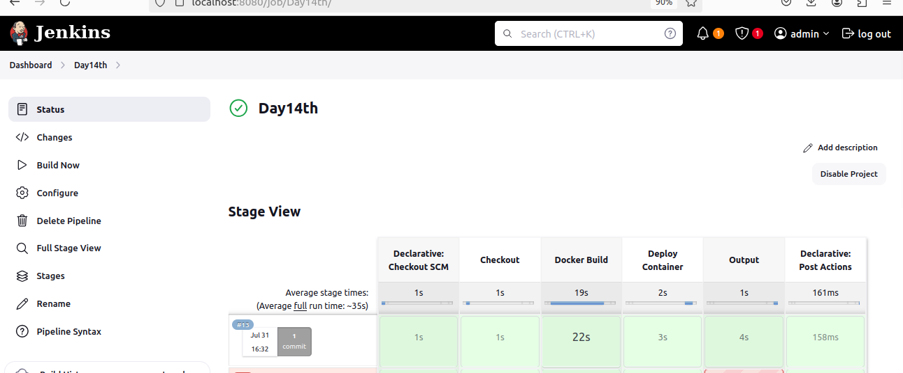
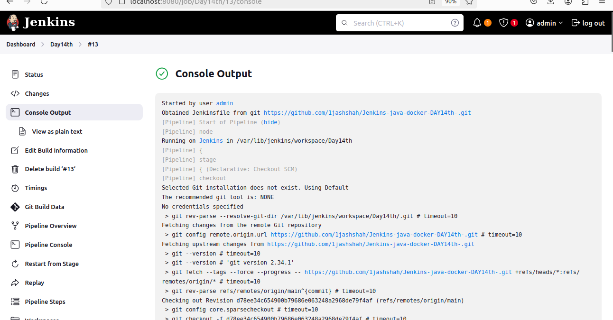

#### **Problem Statement:**

You are tasked with setting up a CI/CD pipeline using Jenkins to
streamline the deployment process of a simple Java application. The
pipeline should accomplish the following tasks:

1.  **Fetch the Dockerfile**: The pipeline should clone a GitHub
    > repository containing the source code of the Java application and
    > a Dockerfile.

2.  **Create a Docker Image**: The pipeline should build a Docker image
    > from the fetched Dockerfile.

3.  **Push the Docker Image**: The pipeline should push the created
    > Docker image to a specified DockerHub repository.

4.  **Deploy the Container**: The pipeline should deploy a container
    > using the pushed Docker image.

#### **Deliverables:**

1.  **GitHub Repository**: A GitHub repository containing:

    -   The source code of a simple Java application.

    -   A Dockerfile for building the Docker image.

> 

2.  **Jenkins Pipeline Script**: A Jenkinsfile (pipeline script) that:

    -   Clones the GitHub repository.

    -   Builds the Docker image.

    -   Pushes the Docker image to DockerHub.

    -   Deploys a container using the pushed image.

> pipeline {
>
> agent any
>
> environment {
>
> registry = \'docker.io\'
>
> registryCredential = \'dockerid\'
>
> }
>
> stages {
>
> stage (\'Checkout\') {
>
> steps {
>
> git url:
> \'https://github.com/1jashshah/Jenkins-java-docker-DAY14th-.git\',
> credentialsId: \'gitid\', branch: \'main\'
>
> }
>
> }
>
> stage (\'Docker Build\') {
>
> steps {
>
> script {
>
> docker.withRegistry(\'\', registryCredential){
>
> def customImage =
> docker.build(\"1jashshah/myjava-app:\${env.BUILD_ID}\")
>
> customImage.push()
>
> }
>
> }
>
> }
>
> }
>
> stage(\'Deploy Container\') {
>
> steps {
>
> script {
>
> docker.withRegistry(\'\', registryCredential) {
>
> def runContainer =
> docker.image(\"1jashshah/myjava-app:\${env.BUILD_ID}\").run(\'\--name
> mynew-container -d\')
>
> echo \"Container ID: \${runContainer.id}\"
>
> }
>
> }
>
> }
>
> }
>
> stage(\'Output\') {
>
> steps{
>
> script{
>
> sh \'javac App.java\'
>
> sh \'java App.java\'
>
> }
>
> }
>
> }
>
> }
>
> post {
>
> always {
>
> echo \'Pipeline Finished\'
>
> }
>
> success {
>
> echo \'Status : Successfull\'
>
> }
>
> failure {
>
> echo \'Status : Failed\'
>
> }
>
> }
>
> }

3.  **DockerHub Repository**: A DockerHub repository where the Docker
    > images will be stored.

4.  **Jenkins Setup**:

    -   Jenkins installed and configured on a local Ubuntu machine.

    -   Required plugins installed (e.g., Git, Docker, Pipeline).

    -   

    -   

5.  **Documentation**: Detailed documentation explaining:

    -   How to set up the local Jenkins environment.

    -   Configuration steps for the pipeline.

    -   Instructions for verifying the deployment.
