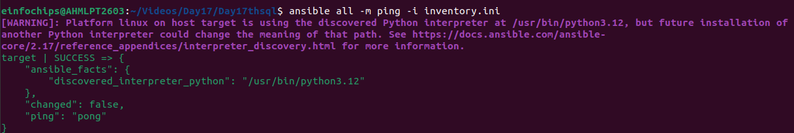
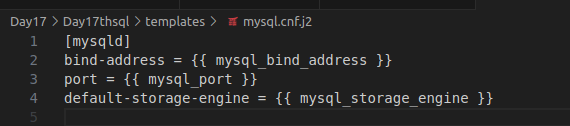
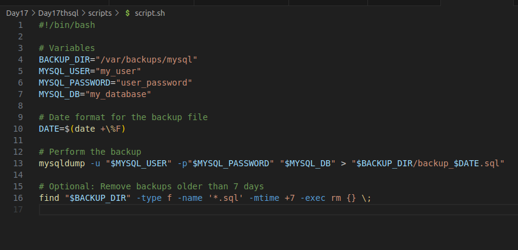
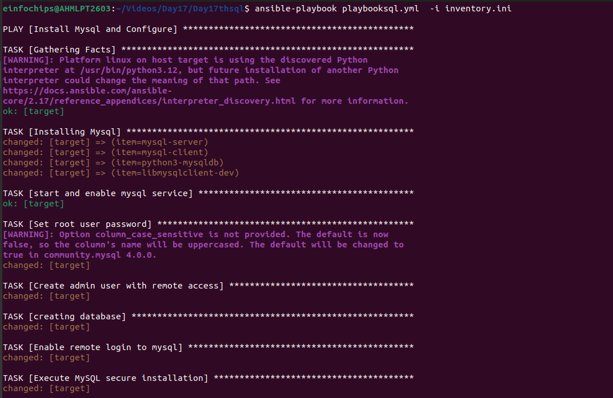
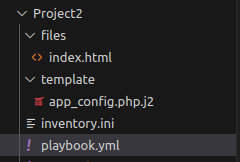
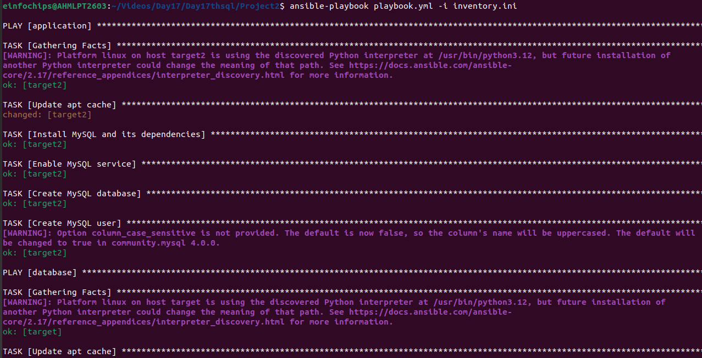

### **Day 17 th Project-01**

### **Deploy a Database Server with Backup Automation**

**Objective**: Automate the deployment and configuration of a PostgreSQL
database server on an Ubuntu instance hosted on AWS, and set up regular
backups.

### **Problem Statement**

**Objective**: Automate the deployment, configuration, and backup of a
PostgreSQL database server on an Ubuntu instance using Ansible.

**Requirements**:

1.  **AWS Ubuntu Instance**: You have an Ubuntu server instance running
    > on AWS.

2.  **Database Server Deployment**: Deploy and configure PostgreSQL on
    > the Ubuntu instance.

3.  **Database Initialization**: Create a database and a user with
    > specific permissions.

4.  **Backup Automation**: Set up a cron job for regular database
    > backups and ensure that backups are stored in a specified
    > directory.

5.  **Configuration Management**: Use Ansible to handle the deployment
    > and configuration, including managing sensitive data like database
    > passwords.

### **Deliverables**

1.  **Ansible Inventory File**

    -   **Filename**: inventory.ini

    -   **Content**: Defines the AWS Ubuntu instance and connection
        > details for Ansible.

{width="6.5in"
height="1.0972222222222223in"}

2.  **Ansible Playbook**

    -   **Filename**: playbooksql.yml

    -   **Content**: Automates the installation of PostgreSQL, sets up
        > the database, creates a user, and configures a cron job for
        > backups. It also includes variables for database configuration
        > and backup settings.

> \-\--
>
> \- name: Install Mysql and Configure
>
> hosts: target
>
> become: true
>
> vars_files:
>
> \- vars.yml
>
> tasks:
>
> \- name: Install MySQL packages
>
> package:
>
> name: \"{{ item }}\"
>
> state: present
>
> update_cache: yes
>
> loop:
>
> \- mysql-server
>
> \- mysql-client
>
> \- python3-mysqldb
>
> \- libmysqlclient-dev
>
> \- name: Start and enable MySQL service
>
> service:
>
> name: mysql
>
> state: started
>
> enabled: yes
>
> \- name: Set root user password
>
> mysql_user:
>
> name: root
>
> password: \"{{ root_password }}\"
>
> login_unix_socket: /var/run/mysqld/mysqld.sock
>
> host: localhost
>
> login_user: root
>
> login_password: \'\'
>
> state: present
>
> \- name: Create admin user with remote access
>
> mysql_user:
>
> name: \"{{ admin_user }}\"
>
> password: \"{{ admin_password }}\"
>
> priv: \'\*.\*:ALL\'
>
> host: \'%\'
>
> append_privs: yes
>
> login_user: root
>
> login_password: \"{{ root_password }}\"
>
> state: present
>
> \- name: Create database
>
> mysql_db:
>
> name: \"{{ db_name }}\"
>
> state: present
>
> login_user: root
>
> login_password: \"{{ root_password }}\"
>
> \- name: Enable remote login to MySQL
>
> lineinfile:
>
> path: /etc/mysql/mysql.conf.d/mysqld.cnf
>
> regex: \'\^bind-address\\s\*=\\s\*127.0.0.1\'
>
> line: \'bind-address = 0.0.0.0\'
>
> backup: yes
>
> notify:
>
> \- Restart MySQL
>
> \- name: Deploy MySQL configuration template
>
> template:
>
> src: mysql.cnf.j2
>
> dest: /etc/mysql/mysql.conf.d/mysqld.cnf
>
> notify:
>
> \- Restart MySQL
>
> \- name: Execute MySQL secure installation
>
> expect:
>
> command: mysql_secure_installation
>
> responses:
>
> \'Enter password for user root:\': \"{{ root_password }}\"
>
> \'Press y\|Y for Yes, any other key for No\': \'Y\'
>
> \'Please enter 0 = LOW, 1 = MEDIUM and 2 = STRONG\': \"{{
> password_validation_policy }}\"
>
> \'Change the password for root ? ((Press y\|Y for Yes, any other key
> for No)\': \'n\'
>
> \'Remove anonymous users? (Press y\|Y for Yes, any other key for
> No)\': \'Y\'
>
> \'Disallow root login remotely? (Press y\|Y for Yes, any other key for
> No)\': \'Y\'
>
> \'Remove test database and access to it? (Press y\|Y for Yes, any
> other key for No)\': \'Y\'
>
> \'Reload privilege tables now? (Press y\|Y for Yes, any other key for
> No)\': \'Y\'
>
> environment:
>
> MYSQL_PWD: \"{{ root_password }}\"
>
> handlers:
>
> \- name: Restart MySQL
>
> service:
>
> name: mysql
>
> state: restarted

3.  **Jinja2 Template**

    -   **Filename**: templates/mysql.conf.j2

    -   **Content**: Defines the PostgreSQL configuration file
        > (pg_hba.conf) using Jinja2 templates to manage access controls
        > dynamically.

> 

4.  **Backup Script**

    -   **Filename**: scripts/backup.sh

    -   **Content**: A script to perform the backup of the PostgreSQL
        > database. This script should be referenced in the cron job
        > defined in the playbook.

> 
>
> 

### **Project 02**

**Objective**: Automate the setup of a multi-tier web application stack
with separate database and application servers using Ansible.

### **Problem Statement**

**Objective**: Automate the deployment and configuration of a multi-tier
web application stack consisting of:

1.  **Database Server**: Set up a mysql database server on one Ubuntu
    > instance.

2.  **Application Server**: Set up a web server (e.g., Apache or Nginx)
    > on another Ubuntu instance to host a web application.

3.  **Application Deployment**: Ensure the web application is deployed
    > on the application server and is configured to connect to the
    > PostgreSQL database on the database server.

4.  **Configuration Management**: Use Ansible to automate the
    > configuration of both servers, including the initialization of the
    > database and the deployment of the web application.

### **Deliverables**

1.  **Ansible Inventory File**

    -   **Filename**: inventory.ini

    -   **Content**: Defines the database server and application server
        > instances, including their IP addresses and connection
        > details.

2.  **Ansible Playbook**

    -   **Filename**:playbook.yml

    -   **Content**: Automates:

        -   The deployment and configuration of the PostgreSQL database
            > server.

        -   The setup and configuration of the web server.

        -   The deployment of the web application and its configuration
            > to connect to the database.

\-\--

\- hosts: application

become: yes

vars:

mysql_root_password: \"jash1234\"

mysql_database: \"webapp_db\"

mysql_user: \"webapp_user\"

mysql_password: \"jash1234\"

tasks:

\- name: Update apt cache

apt:

update_cache: yes

\- name: Install MySQL and its dependencies

apt:

name:

\- mysql-server

\- mysql-client

\- python3-mysqldb

\- libmysqlclient-dev

state: present

\- name: Enable MySQL service

service:

name: mysql

state: started

enabled: yes

\- name: Create MySQL database

mysql_db:

name: \"{{ mysql_database }}\"

state: present

\- name: Create MySQL user

mysql_user:

name: \"{{ mysql_user }}\"

password: \"{{ mysql_password }}\"

priv: \"{{ mysql_database }}.\*:ALL\"

state: present

\- hosts: database

become: yes

vars:

app_repo_url:
\"/home/einfochips/Videos/Day17/Day17thsql/Project2/files/index.html\"

app_directory: \"/var/www/html/\"

db_host: \"{{ hostvars\[\'db_server\'\]\[\'ansible_host\'\] }}\"

db_name: \"webapp_db\"

db_user: \"webapp_user\"

db_password: \"secure_user_password\"

tasks:

\- name: Update apt cache

apt:

update_cache: yes

\- name: Install Apache2

apt:

name: apache2

state: present

\- name: Install PHP and extensions

apt:

name:

\- php

\- php-mysql

\- libapache2-mod-php

state: present

\- name: Ensure Apache is started and enabled

service:

name: apache2

state: started

enabled: yes

\- name: Copy Web Application

ansible.builtin.copy:

src: \"{{ app_repo_url }}\"

dest: \"{{ app_directory }}\"

\- name: Deploy Apache configuration file

template:

src:
/home/einfochips/Videos/Day17/Day17thsql/Project2/template/app_config.php.j2

dest: /etc/apache2/apache2.conf

owner: root

group: root

mode: \'0644\'

notify:

\- Restart Apache

\- name: Ensure appropriate permissions for application directory

file:

path: \"{{ app_directory }}\"

owner: www-data

group: www-data

state: directory

recurse: yes

handlers:

\- name: Restart Apache

service:

name: apache2

state: restarted

3.  **Jinja2 Template**

    -   **Filename**: templates/app_config.php.j2

-   **Content**: Defines a configuration file for the web application
    > that includes placeholders for dynamic values such as database
    > connection details.

4.  **Application Files**

    -   **Filename**: files/index.html (or equivalent application files)

    -   **Content**: Static or basic dynamic content served by the web
        > application.

