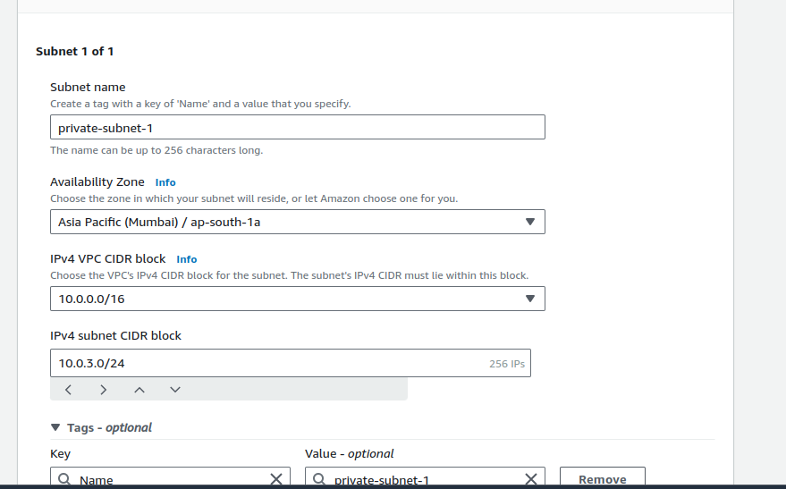
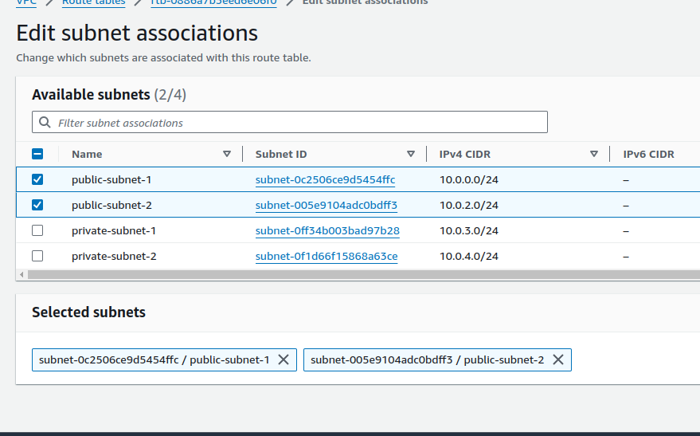

### **1. VPC Design and Implementation**

#### **Design a Custom VPC**

1.  **Create VPC:**

    -   Go to the VPC Dashboard in the AWS Management Console.

    -   Click on **\"Create VPC\"**.

    -   Set up the VPC with the following parameters:

        -   **Name tag:** name-VPC

        -   **IPv4 CIDR block:** 10.0.0.0/16

    -   Click **\"Create VPC\"**.

{width="6.5in"
height="4.041666666666667in"}

2.  **Create Subnets:\
    > **

    -   **Public Subnets:\
        > **

        -   Go to **Subnets** and click **\"Create subnet\"**.

        -   Select the newly created VPC.

        -   **Subnet 1:\
            > **

            -   **Name tag:** Public-Subnet-1

            -   **Availability Zone:** Choose one.

            -   **IPv4 CIDR block:** 10.0.1.0/24

        -   

        -   **Subnet 2:\
            > **

            -   **Name tag:** Public-Subnet-2

            -   **Availability Zone:** Choose another.

            -   **IPv4 CIDR block:** 10.0.2.0/24

        -   

    -   **Private Subnets:\
        > **

        -   Click **\"Create subnet\"** again.

        -   **Subnet 3:\
            > **

            -   **Name tag:** Private-Subnet-1

            -   **Availability Zone:** Same or different from the public
                > subnets.

            -   **IPv4 CIDR block:** 10.0.3.0/24

        -   

        -   **Subnet 4:\
            > **

            -   **Name tag:** Private-Subnet-2

            -   **Availability Zone:** Same or different.

            -   **IPv4 CIDR block:** 10.0.4.0/24

        -   {width="6.5in"
            > height="4.041666666666667in"}\
            > \
            > [\
            > ](https://github.com/yashmahi88/DevOps_Training/blob/master/day26/image-5.png)

3.  **Create and Attach Internet Gateway:\
    > **

    -   Go to **Internet Gateways** and click **\"Create internet
        > gateway\"**.

    -   **Name tag:** demo-tag

-   Click **\"Create internet gateway\"**, then **\"Attach to VPC\"**,
    > and select the VPC you created.

4.  \
    > \
    > [\
    > ](https://github.com/yashmahi88/DevOps_Training/blob/master/day26/image-8.png)

5.  **Configure Route Tables:\
    > **

    -   **Public Route Table:\
        > **

        -   Go to **Route Tables** and click **\"Create route table\"**.

        -   **Name tag:** Public-Route-Table

        -   Change the default created route table when a VPCis created.

    -   

    -   **Private Route Table:\
        > **

        -   Create another route table.

        -   **Name tag:** Private

        -   Associate this route table with the private subnets.

-   

#### **Security Configuration**

1.  **Create Security Groups:\
    > **

    -   **EC2 Security Group:\
        > **

        -   Go to **Security Groups** and click **\"Create security
            > group\"**.

        -   **Name:** EC2-SG

        -   **Description:** Security group for EC2 instances

        -   Add inbound rules for HTTP (port 80), HTTPS (port 443), and
            > SSH (port 22) (restrict SSH to your IP).

    -   

    -   **RDS Security Group:\
        > **

        -   Create another security group.

        -   **Name:** RDS-SG

        -   **Description:** Security group for RDS

        -   Add inbound rule for MySQL/Aurora (port 3306) from the EC2
            > security group.

    -   \
        > \
        > [\
        > ](https://github.com/yashmahi88/DevOps_Training/blob/master/day26/image-11.png)

    -   **Load Balancer Security Group:\
        > **

        -   Create another security group.

        -   **Name:** ALB-SG

        -   **Description:** Security group for ALB

        -   Add inbound rules for HTTP (port 80) and HTTPS (port 443)
            > from anywhere.

    -   

2.  **Configure Network ACLs:\
    > **

    -   **Public Subnets ACL:**

        -   Go to **Network ACLs** and create a new ACL or use default.

        -   **Inbound Rules:** Allow HTTP (port 80), HTTPS (port 443),
            > and all outbound traffic.

        -   **Outbound Rules:** Allow all traffic.

    -   

    -   **Private Subnets ACL:**

        -   Create a new ACL or modify default.

        -   **Inbound Rules:** Allow MySQL/Aurora (port 3306) from the
            > public subnets.

        -   **Outbound Rules:** Allow all traffic.

    -   

### **2. S3 Bucket Configuration for Static Content**

**Create and Configure S3 Buckets:\
**

-   Go to **S3** and click **\"Create bucket\"**.

-   **Bucket name:** jas-bucket-01
    > 

-   **Region:** Choose the same region as your VPC.

-   **Bucket Settings for Block Public Access:** Ensure **\"Block all
    > public access\"** is turned off.

-   Click **\"Create bucket\"**. 

**Set Bucket Policies:\
**

-   Go to **Permissions** tab and **Bucket Policy**.

Add the following policy to allow public read access:\
\
{

\"Version\": \"2012-10-17\",

\"Statement\": \[

{

\"Effect\": \"Allow\",

\"Principal\": \"\*\",

\"Action\": \"s3:GetObject\",

\"Resource\":
\"arn:aws:s3:::shopmax-static-content-\[your-initials\]/\*\"

}

\]

-   }

    -   

    -   Enable versioning and logging under the **Management** tab.

1.  

2.  **(Optional) Optimize Content Delivery:\
    > **

    -   Create another S3 bucket for backups or archival, using
        > lifecycle rules to transition old files to Glacier.

### **3. EC2 Instance Setup and Web Server Configuration**

**Launch EC2 Instances:\
**

-   Go to **EC2 Dashboard** and click **\"Launch Instance\"**.

-   **AMI:** Select Ubuntu Server (e.g., Ubuntu 22.04 LTS).

-   **Instance Type:** Choose t2.micro.

-   **Network:** Select the VPC you created.

-   **Subnet:** Choose one of the public subnets.

-   **Auto-assign Public IP:** Enable.

-   **Storage:** Configure as needed.

-   **Security Group:** Select the security group.

-   Launch the instance and repeat to create a second instance.\
    > \
    > [\
    > \
    > ](https://github.com/yashmahi88/DevOps_Training/blob/master/day26/image-19.png)[\
    > ](https://github.com/yashmahi88/DevOps_Training/blob/master/day26/image-20.png)

**SSH into Instances and Configure:\
**

-   SSH into both instances:\
    > ssh -i your-key.pem ubuntu@\<public-ip\>

Update and install necessary packages:

sudo apt update

sudo apt install -y apache2

sudo systemctl start apache2

sudo systemctl enable apache2

-   Configure Apache to serve your [{width="6.5in"
    > height="3.7222222222222223in"}](https://github.com/yashmahi88/DevOps_Training/blob/master/day26/image-23.png)

1.  e-commerce application and link to S3 for static content.

### **4. RDS Setup and Database Configuration**

**Provision RDS Instance:\
**

-   Go to **RDS Dashboard** and click **\"Create database\"**.

-   **Engine:** MySQL.

-   **Template:** Free Tier.

-   **DB Instance Class:** t3.micro.

-   **Storage:** Configure as needed.

-   **VPC & Subnet:** Select your VPC and private subnets.

-   **Public Access:** No.

-   **DB Security Groups:** Select the RDS-SG security group.

-   **Database Settings:** Configure as needed (DB name, master
    > username, and password).

\
\
[\
](https://github.com/yashmahi88/DevOps_Training/blob/master/day26/image-25.png)

**Database Schema:\
**

-   Connect to the RDS instance using a MySQL client.\
    > mysql -h \<rds-endpoint\> -u \<username\> -p

    -   Create necessary tables for the e-commerce application.

1.  **Database Security:\
    > **

    -   Ensure encryption at rest and in transit are enabled in RDS
        > settings.

    -   Restrict access to the database from the EC2 instances using the
        > RDS-SG security group.

### **5. Load Balancer and Auto Scaling Configuration**

1.  **Set Up Application Load Balancer (ALB):\
    > **

    -   Go to **EC2 Dashboard** and click **\"Load Balancers\"**.

    -   Click **\"Create Load Balancer\"** and select **Application Load
        > Balancer**.

    -   **Name:** ALB-DAY26 

    -   **Scheme:** Internet-facing.

    -   **Listeners:** HTTP (port 80).

    -   **Availability Zones:** Select your public subnets.

    -   **Target Groups:** Create a target group for EC2 instances.

    -   Register your EC2 instances and configure health checks. [{width="6.5in"
        > height="4.888888888888889in"}](https://github.com/yashmahi88/DevOps_Training/blob/master/day26/image-27.png)

2.  {width="6.5in"
    > height="4.888888888888889in"}\
    > \
    > [{width="6.5in"
    > height="4.888888888888889in"}\
    > \
    > ](https://github.com/yashmahi88/DevOps_Training/blob/master/day26/image-29.png)
    > [{width="6.5in"
    > height="3.763888888888889in"}\
    > ](https://github.com/yashmahi88/DevOps_Training/blob/master/day26/image-30.png)

3.  **Configure Auto Scaling:\
    > **

    -   Go to **EC2 Dashboard** and click **\"Auto Scaling Groups\"**.

    -   Click **\"Create Auto Scaling Group\"**.

    -   **Launch Template:** Create or select an existing launch
        > template with Ubuntu AMI.

    -   **Group Size:** Desired: 2, Minimum: 1, Maximum: 2.

    -   **Scaling Policies:** Add policies based on CPU utilization
        > (scale out at 70%, scale in at 30%).

4.  {width="6.5in"
    > height="3.9027777777777777in"}\
    > \
    > [{width="6.5in"
    > height="5.930555555555555in"}\
    > \
    > ](https://github.com/yashmahi88/DevOps_Training/blob/master/day26/image-32.png)
    > [{width="6.5in"
    > height="5.930555555555555in"}\
    > \
    > ](https://github.com/yashmahi88/DevOps_Training/blob/master/day26/image-33.png)
    > [{width="6.5in"
    > height="1.0833333333333333in"}\
    > ](https://github.com/yashmahi88/DevOps_Training/blob/master/day26/image-34.png)
