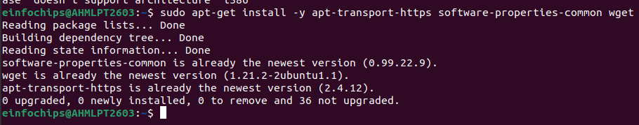

Install the prerequisite packages:

sudo apt-get install -y apt-transport-https software-properties-common
wget

Import the GPG key:

sudo mkdir -p /etc/apt/keyrings/

wget -q -O - https://apt.grafana.com/gpg.key \| gpg \--dearmor \| sudo
tee /etc/apt/keyrings/grafana.gpg \> /dev/null

To add a repository for stable releases, run the following command:

echo \"deb \[signed-by=/etc/apt/keyrings/grafana.gpg\]
https://apt.grafana.com stable main\" \| sudo tee -a
/etc/apt/sources.list.d/grafana.list

To add a repository for beta releases, run the following command:

echo \"deb \[signed-by=/etc/apt/keyrings/grafana.gpg\]
https://apt.grafana.com beta main\" \| sudo tee -a
/etc/apt/sources.list.d/grafana.list

Run the following command to update the list of available packages:

\# Updates the list of available packages

sudo apt-get update

To install Grafana Enterprise, run the following command:

\# Installs the latest Enterprise release:

sudo apt-get install grafana-enterprise

sudo systemctl start grafana-server

sudo systemctl enable grafana-server

sudo systemctl status grafana-server

