#### **Project Setup (15 minutes)**

1.  **Install Git**: Ensure Git is installed on your system. Verify with
    > git \--version.

**Set Up Git**: Configure your Git username and email:\
\
git config \--global user.name \"Your Name\"

git config \--global user.email \"your.email@example.com\"

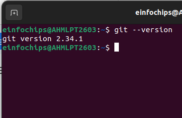

1.  **Create a GitHub Repository**:

    -   Go to GitHub and create a new repository named website-project.

Clone the repository to your local machine:\
\
git clone https://github.com/your-username/website-project.git

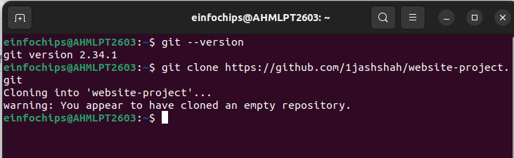

1.  **Initialize the Project**:

Navigate to the project directory:\
\
cd website-project

-   

Create initial project structure:\
\
mkdir src

touch src/index.html

echo \"\<!DOCTYPE html\>\<html\>\<head\>\<title\>My
Website\</title\>\</head\>\<body\>\<h1\>Welcome to my
website!\</h1\>\</body\>\</html\>\" \> src/index.html

-   

Commit and push the initial project structure:\
\
git add .

git commit -m \"Initial commit: Added project structure and index.html\"

git push origin main

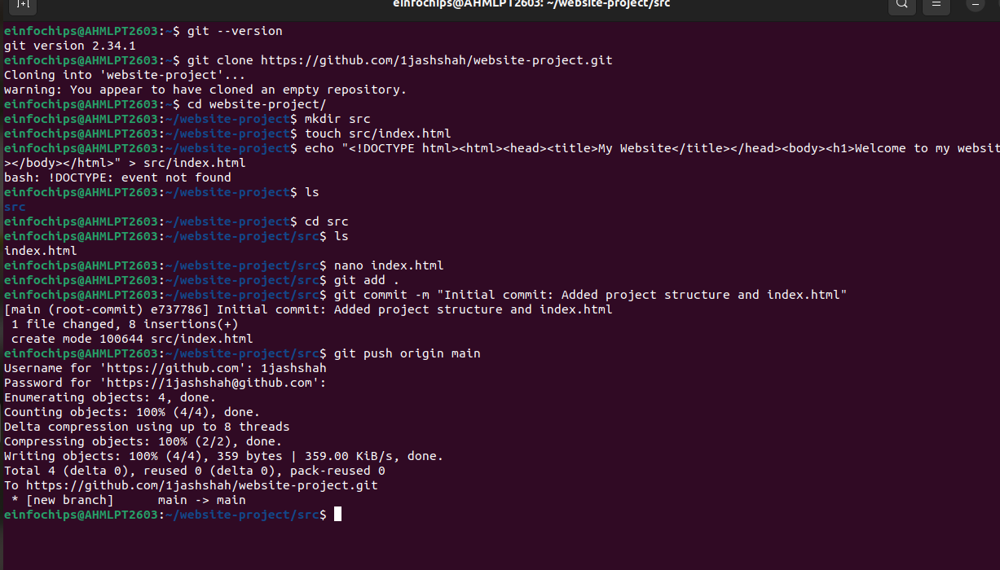

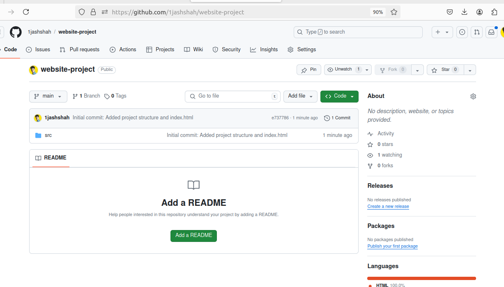

#### **Exercise 1: Branching and Adding Features (20 minutes)**

**Create a New Branch for Blog Post Feature**:\
\
git checkout -b feature/add-blog-post

git checkout: This command is used to switch branches or restore working
tree files.

-   -b: This option tells Git to create a new branch before switching to
    > it.

```{=html}
<!-- -->
```
-   feature/add-blog-post: This is the name of the new branch being
    > created.

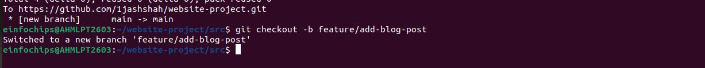

1.  **Add a Blog Post Page**:

Create blog.html:\
\
touch src/blog.html

echo \"\<!DOCTYPE html\>\<html\>\<head\>\<title\>Blog
Post\</title\>\</head\>\<body\>\<h1\>My First Blog
Post\</h1\>\</body\>\</html\>\" \> src/blog.html

-   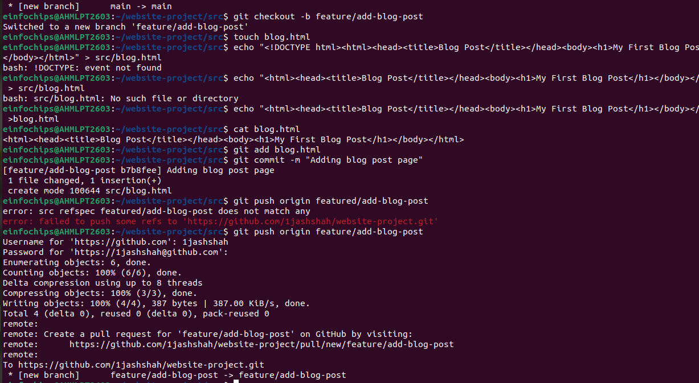

Commit and push changes:\
\
git add src/blog.html

git commit -m \"Added blog post page\"

git push origin feature/add-blog-post

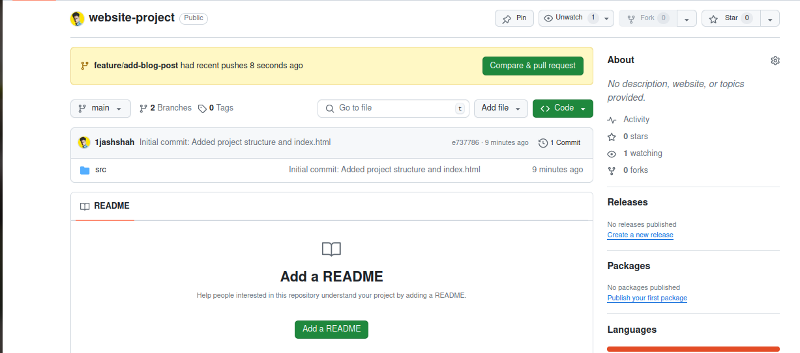{
#### **Exercise 2: Collaborating with Merging and Handling Merge Conflicts (25 minutes)**

**Create Another Branch for Author Info**:\
\
git checkout main

git checkout -b feature/add-author-info

1.  **Add Author Info to Blog Page**:

Modify blog.html:\
\
echo \"\<p\>Author: John Doe\</p\>\" \>\> src/blog.html

Commit and push changes:\
\
git add src/blog.html

git commit -m \"Added author info to blog post\"

git push origin feature/add-author-info

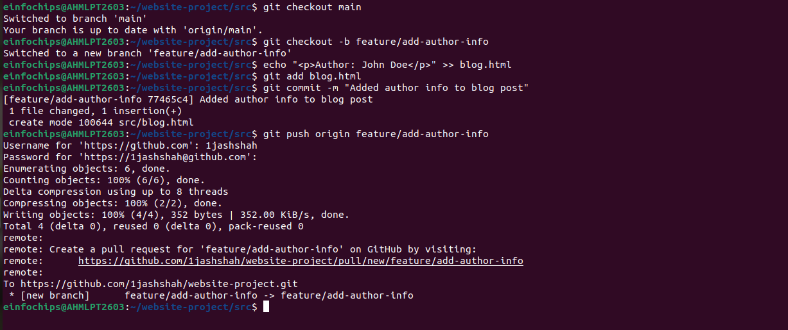
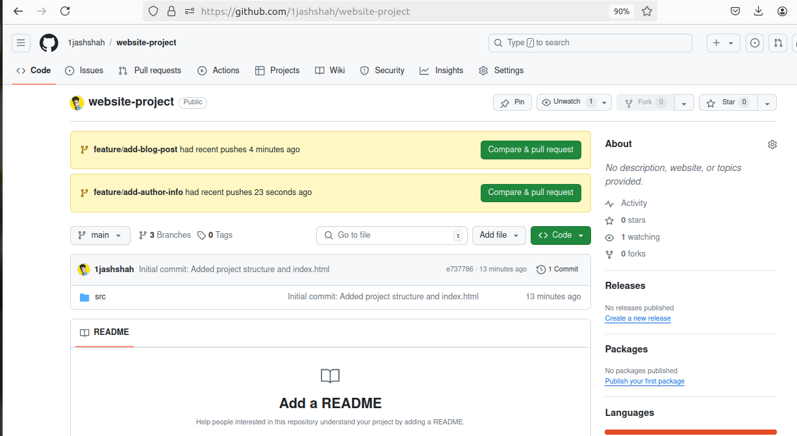

**Create a Merge Conflict**:

Modify blog.html on the feature/add-blog-post branch:\
\
git checkout feature/add-blog-post

echo \"\<p\>Published on: July 10, 2024\</p\>\" \>\> src/blog.html

git add src/blog.html

git commit -m \"Added publish date to blog post\"

git push origin feature/add-blog-post

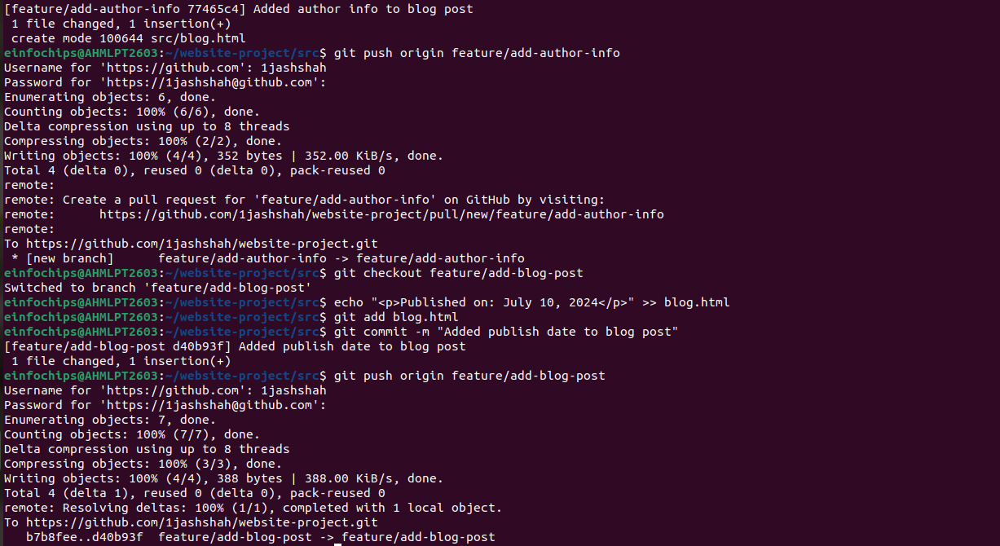
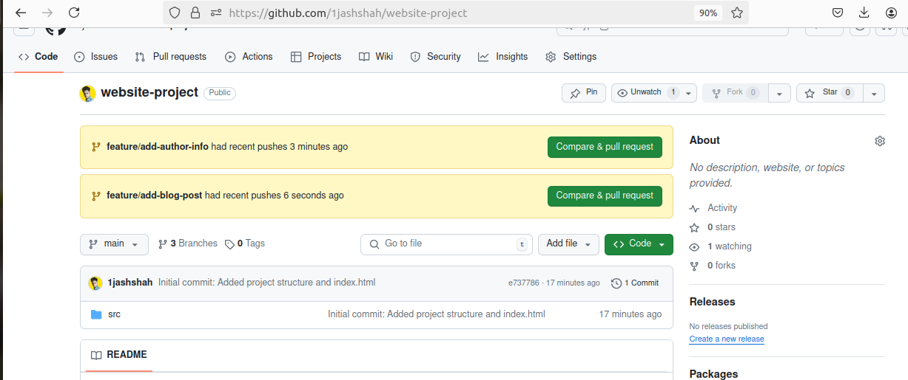

**Merge and Resolve Conflict**:

Attempt to merge feature/add-blog-post into main:\
\
git checkout main

git merge feature/add-blog-post

-   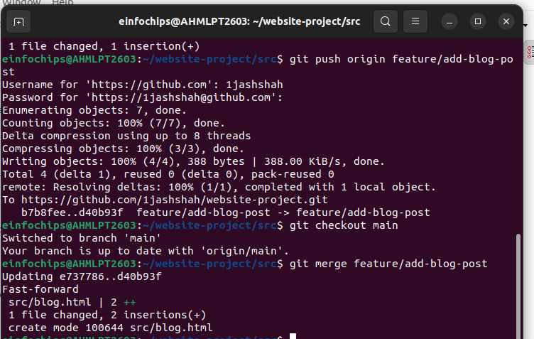

Resolve the conflict in src/blog.html, then:\
\
git add src/blog.html

git commit -m \"Resolved merge conflict in blog post\"

git push origin main

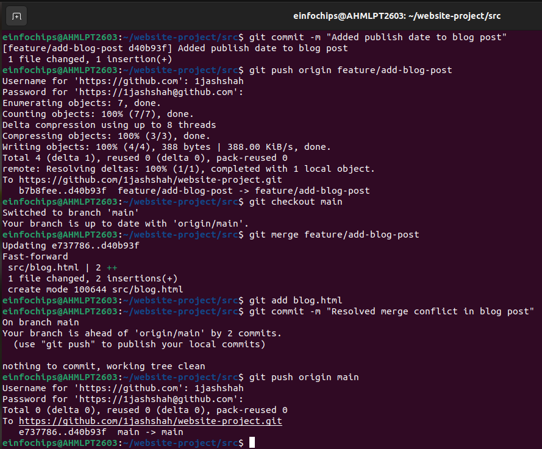

#### **Exercise 3: Rebasing and Feature Enhancement (25 minutes)**

1.  **Rebase a Branch for Comment Feature**:

Rebase feature/add-author-info onto main:\
\
git checkout feature/add-author-info

git rebase main

-   Resolve any conflicts that arise during rebase.

2.  **Add Comment Section**:

Modify blog.html to add a comment section:\
\
echo \"\<h2\>Comments\</h2\>\<p\>No comments yet.\</p\>\" \>\>
src/blog.html

git add src/blog.html

git commit -m \"Added comment section\"

git push origin feature/add-author-info

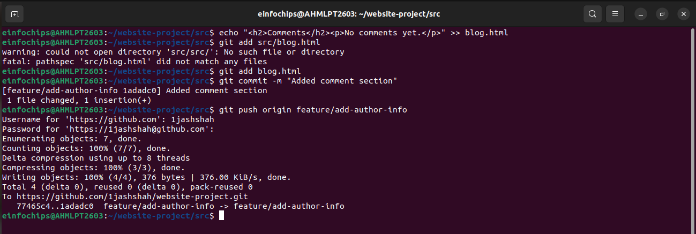
#### **Exercise 4: Pulling and Simulating Collaboration (20 minutes)**

1.  **Pull Changes from Remote**:

Ensure the main branch is up-to-date:\
\
git checkout main

git pull origin main

-   

2.  **Simulate a Collaborator\'s Change**:

    -   Make a change on GitHub directly (e.g., edit blog.html to add a
        > new comment).

3.  **Pull Collaborator\'s Changes**:

Pull the changes made by the collaborator:\
\
git pull origin main

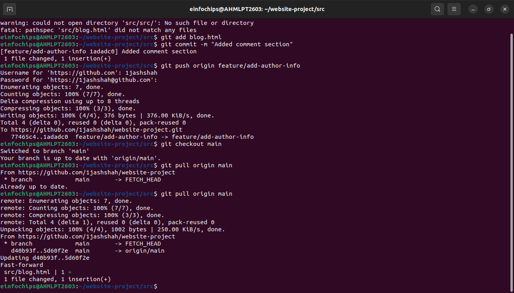
#### **Exercise 5: Versioning and Rollback (30 minutes)**

1.  **Tagging a Version**:

Tag the current commit as v1.0:\
\
git tag -a v1.0 -m \"Version 1.0: Initial release\"

git push origin v1.0

-   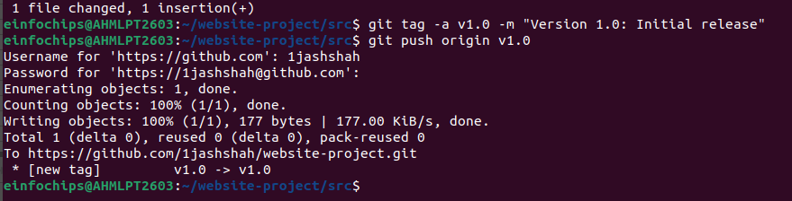

2.  **Make a Change that Needs Reversion**:

Modify blog.html:\
\
echo \"\<p\>Incorrect comment\</p\>\" \>\> src/blog.html

git add src/blog.html

git commit -m \"Incorrect comment update\"

git push origin main

-   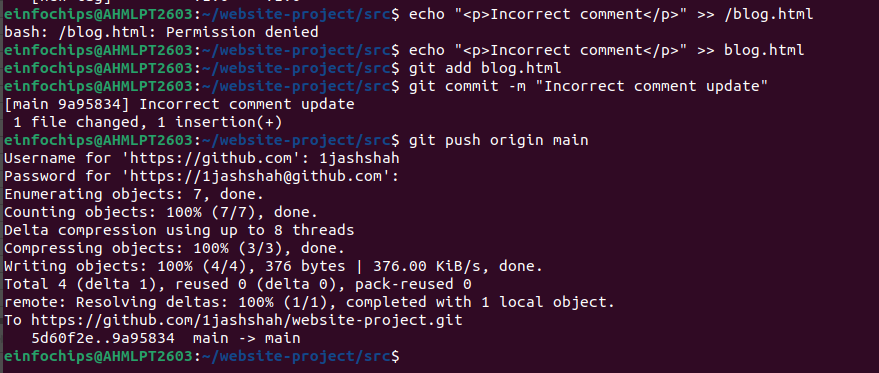

3.  **Revert to a Previous Version**:

Use git revert to undo the last commit:\
\
git revert HEAD

git push origin main

-   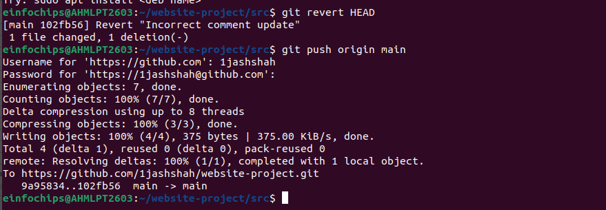
Alternatively, reset to a specific commit (use with caution):\
\
git reset \--hard v1.0

git push -f origin main

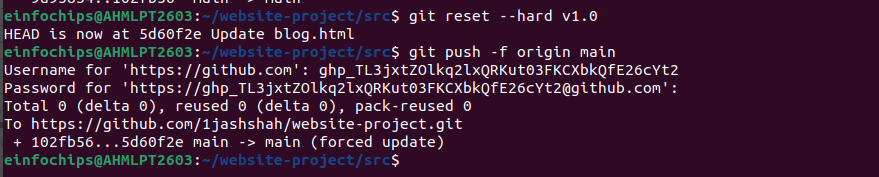

#### **Extra Activities (25 minutes)**

1.  **Stashing Changes**:

Make some local changes without committing:\
\
echo \"\<p\>Uncommitted changes\</p\>\" \>\> src/blog.html

Stash the changes:\
\
git stash

Apply the stashed changes:\
\
git stash apply

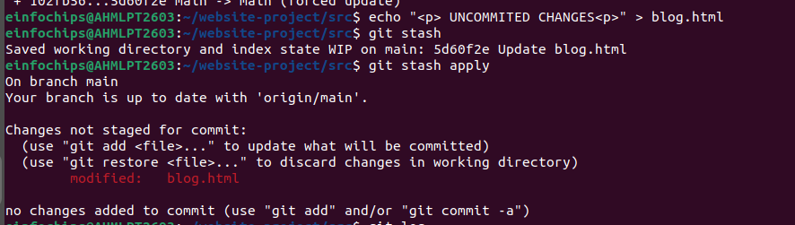
2.  **Viewing Commit History**:

Use git log to view commit history:\
\
git log --oneline

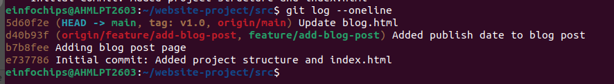

3.  **Cherry-Picking Commits**:

Create a new branch and cherry-pick a commit from another branch:\
\
git checkout -b feature/cherry-pick

git cherry-pick \<commit-hash\>

git push origin feature/cherry-pick

4.  **Interactive Rebase**:

Use interactive rebase to squash commits:\
\
git checkout main

git rebase -i HEAD\~3

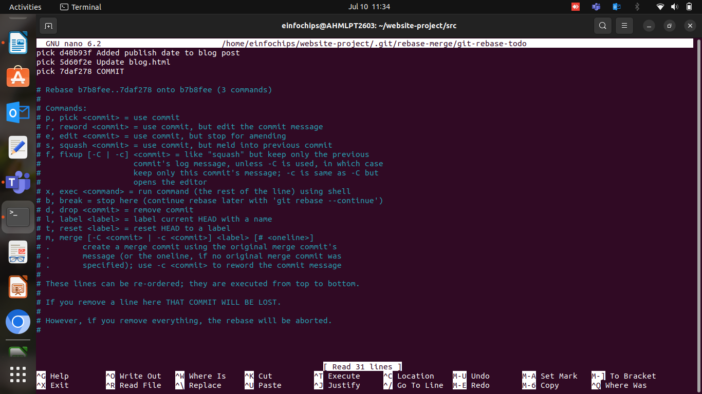
