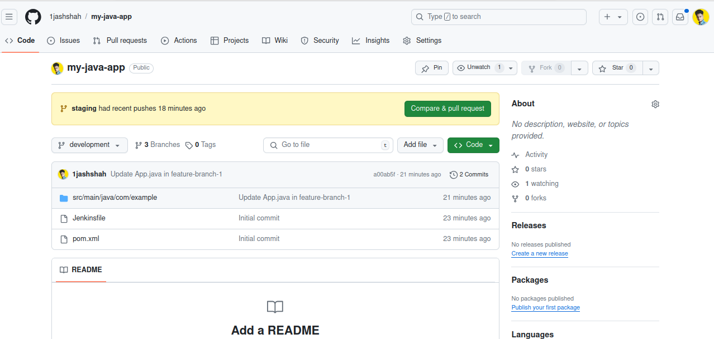
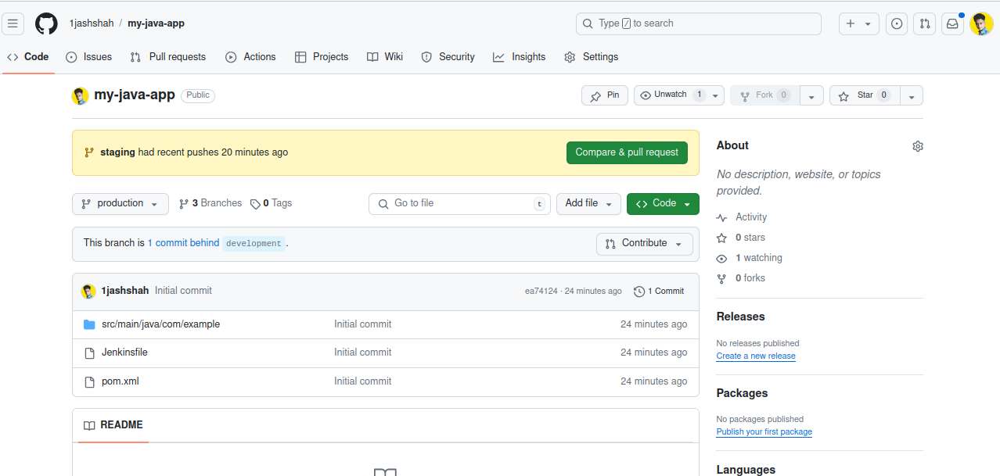
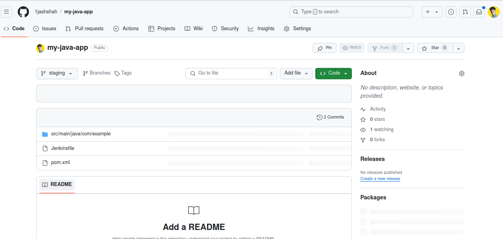
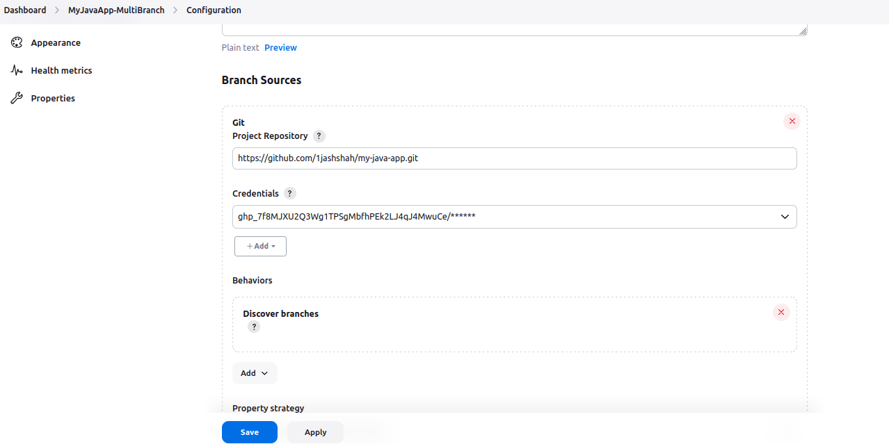
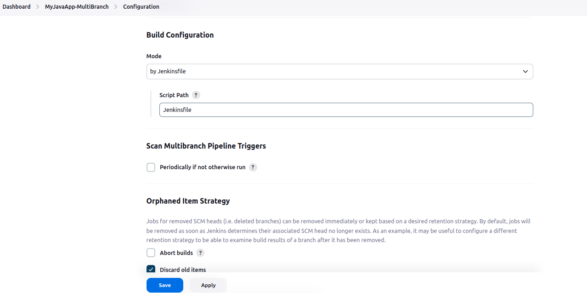
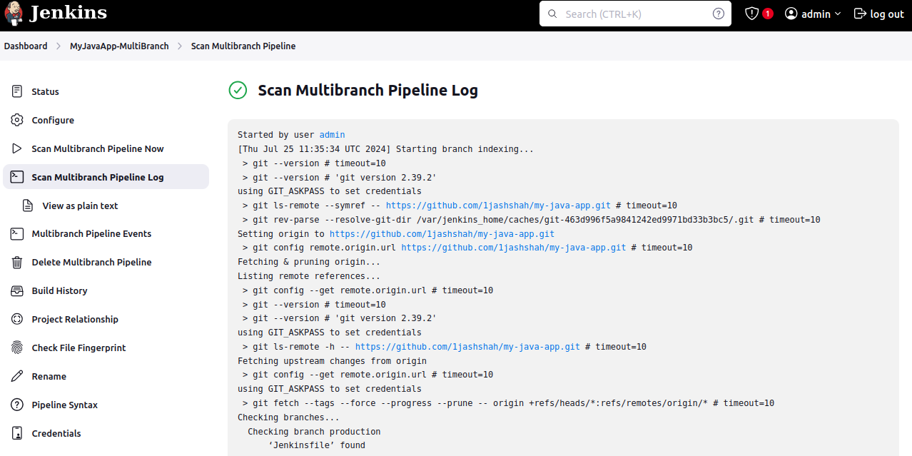

### **Multi-Branch Pipeline for a Simple Java Maven Project**

#### **1. Setup the Project Repository**

Let\'s assume you have a Git repository with a Java Maven project.
Here's a simple example of the project structure:

my-java-app/

├── pom.xml

└── src

└── main

└── java

└── com

└── example

└── App.java

**pom.xml**

\<?xml version=\"1.0\" encoding=\"UTF-8\"?\>

\<project xmlns=\"http://maven.apache.org/POM/4.0.0\"

xmlns:xsi=\"http://www.w3.org/2001/XMLSchema-instance\"

xsi:schemaLocation=\"http://maven.apache.org/POM/4.0.0
http://maven.apache.org/POM/4.0.0/maven-4.0.0.xsd\"\>

\<modelVersion\>4.0.0\</modelVersion\>

\<groupId\>com.example\</groupId\>

\<artifactId\>my-java-app\</artifactId\>

\<version\>1.0-SNAPSHOT\</version\>

\<properties\>

\<maven.compiler.source\>1.8\</maven.compiler.source\>

\<maven.compiler.target\>1.8\</maven.compiler.target\>

\</properties\>

\</project\>

**App.java**

package com.example;

public class App {

public static void main(String\[\] args) {

System.out.println(\"Hello, Maven!\");

}

}

#### **2. Create Branches**

Create different branches to demonstrate the multi-branch pipeline
functionality:

cd my-java-app

git init

git add .

git commit -m \"Initial commit\"

git branch feature-branch-1

git branch feature-branch-2

git checkout feature-branch-1

\# Modify App.java for feature-branch-1

echo \"System.out.println(\\\"Feature Branch 1!\\\");\" \>
src/main/java/com/example/App.java

git add src/main/java/com/example/App.java

git commit -m \"Update App.java in feature-branch-1\"

git push -u origin feature-branch-1

git checkout feature-branch-2

\# Modify App.java for feature-branch-2

echo \"System.out.println(\\\"Feature Branch 2!\\\");\" \>
src/main/java/com/example/App.java

git add src/main/java/com/example/App.java

git commit -m \"Update App.java in feature-branch-2\"

git push -u origin feature-branch-2

#### **3. Create a Jenkinsfile**

Create a Jenkinsfile in the root of your repository. This file defines
how Jenkins will build and test your application.

**Jenkinsfile**

pipeline {

agent any

stages {

stage(\'Build\') {

steps {

echo \'Building the Java application\...\'

sh \'mvn clean package\'

}

}

stage(\'Test\') {

steps {

echo \'Running tests\...\'

// Add your test commands here if you have tests

}

}

}

post {

success {

echo \'Build and test succeeded!\'

}

failure {

echo \'Build or test failed!\'

}

}

}

#### **4. Configure Jenkins**

1.  **Install Required Plugins** Ensure Jenkins has the following
    > plugins installed:

    -   **Git Plugin**: To pull code from Git repositories.

    -   **Pipeline Plugin**: To support pipeline jobs.

    -   **Multi-Branch Pipeline Plugin**: To support multi-branch
        > pipelines.

2.  **Create a Multi-Branch Pipeline Job**

    -   Go to Jenkins Dashboard.

    -   Click on New Item.

    -   Enter a name for your job (e.g., MyJavaApp-MultiBranch).

    -   Select Multi-branch Pipeline and click OK.

3.  **Configure the Multi-Branch Pipeline Job**

    -   **Branch Sources**:

        -   Add a source for your Git repository.

        -   Configure the repository URL and credentials (if required).

    -   **Build Configuration**:

        -   Jenkins will automatically scan branches for Jenkinsfile and
            > create a pipeline for each branch.

4.  **Set Up Webhooks (Optional but Recommended)**

    -   To trigger builds automatically when code is pushed to the
        > repository, configure a webhook in your Git repository that
        > points to your Jenkins server.

#### **5. Run and Monitor**

-   Jenkins will scan your repository and create pipelines for each
    > branch with a Jenkinsfile.

-   For each branch, Jenkins will execute the pipeline defined in
    > Jenkinsfile and provide build statuses.

### 

### 

### **Multi-Branch Project**

#### **Project Overview**

-   Create a simple Java Maven project.

-   Version-control the project using Git with multiple branches.

-   Set up Jenkins multi-branch pipeline for automated build and
    > deployment.

-   Utilize Jenkins environment variables in the Jenkinsfile.

> 
>
> 
>
> 

#### **Project Objectives**

-   Version-control using Git.

-   Jenkins multi-branch pipeline setup.

-   Environment variable management using Jenkinsfile.

{width="6.5in"
height="3.25in"}

{width="6.5in"
height="3.25in"}

{width="6.5in"
height="3.25in"}

{width="6.5in"
height="3.25in"}

#### **Project Deliverables**

1.  **Git Repository:**

    -   Local Git repository initialized.

    -   Branches: development, staging, and production.

    -   Repository pushed to remote Git server (e.g., GitHub, GitLab,
        > Bitbucket).

2.  **Maven Project:**

    -   Simple Java Maven project created (HelloWorld application).

    -   pom.xml with dependencies and build configurations.

3.  **Jenkins Setup:**

    -   Multi-branch pipeline job configured in Jenkins.

    -   Jenkinsfile defining build and deployment steps.

    -   Environment variables managed using Jenkins environment variable
        > settings.
